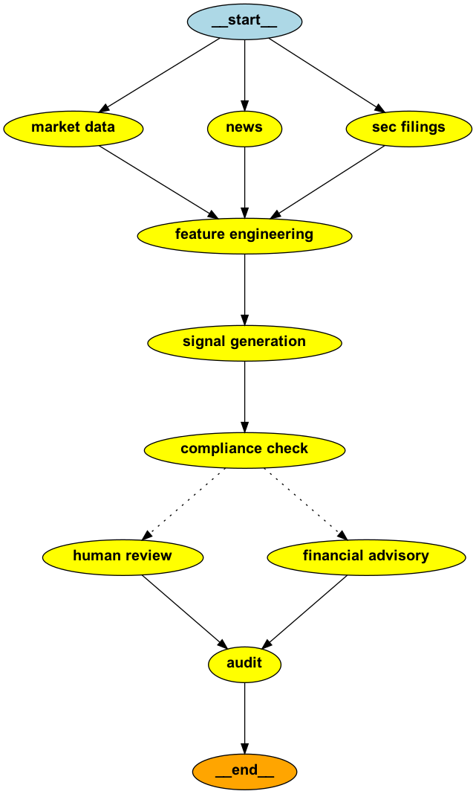

# 💹 AI Financial Research & Advisory Agent  

An end-to-end **LangGraph-powered financial research and advisory system** that autonomously collects, analyzes, and audits stock market data. It integrates **machine learning**, **LLMs**, and **compliance-driven auditing** to simulate real-world investment decision-making with built-in human oversight.  

### 🚀 Features  

- Real-time data ingestion from **Yahoo Finance**, **NewsAPI**, and **SEC Edgar**  
- Technical indicator computation: RSI, MACD, Moving Averages, Volatility  
- ML-driven **BUY / SELL / HOLD** signal generation using Random Forest  
- GPT-4–powered **financial advisory** with compliance-safe recommendations  
- Automated **compliance checks**, restricted stock detection, and risk scoring  
- **MongoDB-based audit trail** ensuring traceability and explainability  
- **LangGraph workflow orchestration** and checkpointing for reproducibility  

### 🧠 System Architecture

`[Data Ingestion] → [Feature Engineering] → [Signal Generation] → [Compliance Check] → [Financial Advisory/Human Review] → [Audit & Logging] → END`  

### LangGraph Workflow Diagram

<p align="center">
  
</p>

### 🛠️ Tech Stack  

<ul>
    <li>LangGraph</li> 
    <li>LangChain</li> 
    <li>OpenAI GPT-4</li> 
    <li>Scikit-learn</li> 
    <li>YFinance</li> 
    <li>NewsAPI</li> 
    <li>SEC-API</li> 
    <li>MongoDB</li> 
    <li>Streamlit</li>
</ul>  

### ⚙️ Installation & Setup  

```bash
git clone https://github.com/<your-username>/ai-financial-research-agent.git
cd ai-financial-research-agent
python3 -m venv venv
source venv/bin/activate
pip install -r requirements.txt
```

Create a .env file and include:

```bash
NEWS_API_KEY=your_newsapi_key  
SEC_EDGAR_API_KEY=your_sec_api_key  
MONGO_URI=your_mongodb_uri  
OPENAI_API_KEY=your_openai_key  
```

Then execute:

```bash
python workflow.py
```

(Optional UI):

```bash
streamlit run main.py
```

### 📊 Example Output

```
Audit log recorded for GOOGL | Decision: Automated Financial Advisory  
{
  "symbol": "GOOGL",
  "signal": "BUY",
  "confidence": 87.42,
  "accuracy": 81.65,
  "risk": 0.34,
  "compliance_status": "PASS",
  "decision_source": "Automated Financial Advisory",
  "final_advice": "Based on RSI and MACD trends, GOOGL indicates short-term bullish strength with controlled risk."
}
```

### 🧩 Future Enhancements

<ul>
	<li>Interactive Streamlit dashboard for visualization</li>
	<li>Multi-asset portfolio simulation & optimization</li>
	<li>LLM-based personalized risk narratives</li>
	<li>Real-time trading integration via broker APIs</li>
</ul>

### 👨‍💻 Author

Sayam Kumar<br>
📧 sayamk565@gmail.com | 📞 +1 (437) 876-4544<br>
🔗 [LinkedIn](https://www.linkedin.com/in/sayam-kumar/) | [GitHub](https://github.com/SayamAlt?tab=repositories)

### 🪪 License

Licensed under the MIT License - free to use, modify, and distribute with proper attribution.